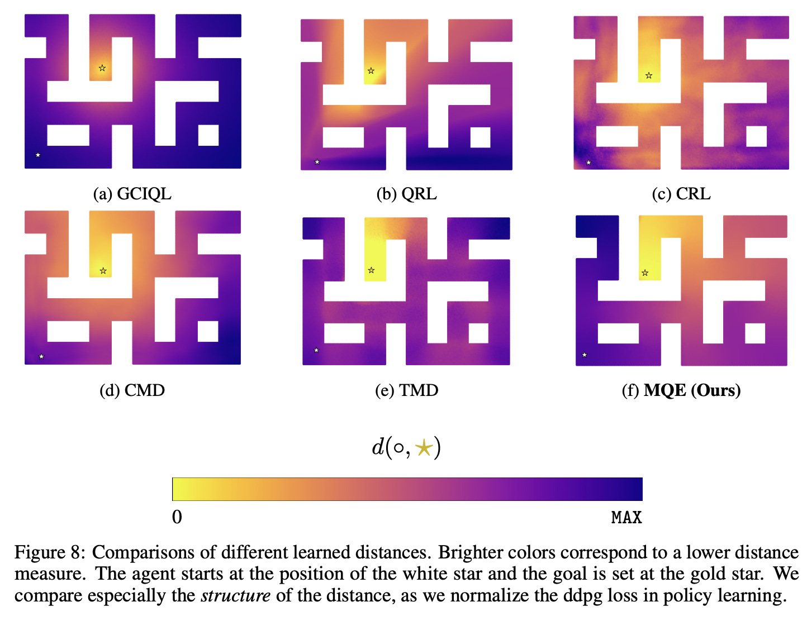

</img>

## Multistep Quasimetric Estimation - (wip)

Exploration and eventually practical implementation for the [Multistep Quasimetric Estimation](https://arxiv.org/abs/2511.07730) proposed by Zheng et al. of Berkeley

## Usage

```python
import torch
from MQE import Policy

policy = Policy(
    action_dim = 4,
    is_continuous = True, # set to False for discrete categorical actions
    pretrained = False    # whether to use ImageNet pretrained ResNet34 weights
)

state_img = torch.randn(2, 3, 224, 224)
goal_img = torch.randn(2, 3, 224, 224)

actions = policy(state_img, goal_img) # (2, 4)
```

## Citations

```bibtex
@misc{zheng2026multistepquasimetriclearningscalable,
    title   = {Multistep Quasimetric Learning for Scalable Goal-conditioned Reinforcement Learning},
    author  = {Bill Chunyuan Zheng and Vivek Myers and Benjamin Eysenbach and Sergey Levine},
    year    = {2026},
    eprint  = {2511.07730},
    archivePrefix = {arXiv},
    primaryClass = {cs.LG},
    url     = {https://arxiv.org/abs/2511.07730},
}
```

```bibtex
@misc{liu2023metricresidualnetworkssample,
    title   = {Metric Residual Networks for Sample Efficient Goal-Conditioned Reinforcement Learning},
    author  = {Bo Liu and Yihao Feng and Qiang Liu and Peter Stone},
    year    = {2023},
    eprint  = {2208.08133},
    archivePrefix = {arXiv},
    primaryClass = {cs.LG},
    url     = {https://arxiv.org/abs/2208.08133},
}
```
